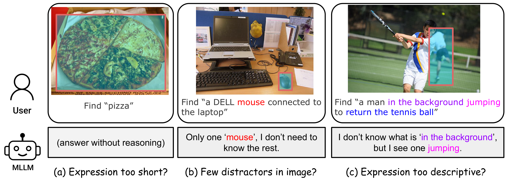

# Ref-Adv

🏠[Website](https://ref-adv.github.io) | 🤗[Dataset](https://huggingface.co/datasets/dddraxxx/ref-adv-s) | 📄[Paper](https://arxiv.org/abs/2602.23898)

Official code for **"Ref-Adv: Exploring MLLM Visual Reasoning in Referring Expression Tasks"** (ICLR 2026).

<p align="center">
  
</p>

## 🔥 News

- **[2026/08]** 🎉 Ref-Adv-s is now supported by [EvalScope](https://evalscope.readthedocs.io/en/latest/benchmarks/ref_adv_s.html)! 🚀 Thanks to the EvalScope team for the integration! 🙌
- **[2026/01]** Ref-Adv accepted to ICLR 2026!
- **[2026/01]** Evaluation code and model predictions released.

## 📖 Introduction

Ref-Adv is a referring expression comprehension (REC) benchmark designed to probe the visual reasoning capabilities of multimodal large language models (MLLMs). Standard REC benchmarks contain shortcuts that allow models to succeed without true visual reasoning. Ref-Adv addresses this by pairing complex referring expressions with hard visual distractors, featuring an average expression length of 11.5 words, 4.01 distractors per image (each case contains at least 2 distractors), and a 21.25% negation ratio.

**Ref-Adv-s** is the publicly released subset containing **1,142 cases** with evaluation code and model predictions. The dataset is uploaded to [HuggingFace](https://huggingface.co/datasets/dddraxxx/ref-adv-s).

## ⚙️ Setup

```bash
git clone https://github.com/dddraxxx/Ref-Adv.git
cd Ref-Adv
pip install -r requirements.txt
```

## 🧪 Evaluation

### 🚀 Evaluate with EvalScope

Ref-Adv-s is also supported by EvalScope for evaluation with OpenAI-compatible model endpoints. See the [EvalScope usage guide](https://evalscope.readthedocs.io/en/latest/benchmarks/ref_adv_s.html).

```bash
evalscope eval \
  --model YOUR_MODEL \
  --api-url OPENAI_API_COMPAT_URL \
  --api-key EMPTY_TOKEN \
  --datasets ref_adv_s \
  --limit 10
```

Remove `--limit 10` to evaluate the full dataset. See the usage guide above for setup and model-specific options.

### Pre-computed Predictions

All model predictions are included in `outputs/qwen/`. You can directly run `report.py` on these files to reproduce the results table without re-running inference.

### VLM Serving

We serve the Qwen VLM series using their official repositories with [vLLM](https://docs.vllm.ai/):

- [Qwen2.5-VL / Qwen3-VL](https://github.com/QwenLM/Qwen3-VL)
- [Qwen3.5](https://github.com/QwenLM/Qwen3.5)

Generation parameters (temperature, top_p, etc.) are specified in `configs/qwen.yaml`.

### Run One Eval

Start an OpenAI-compatible server first (model must match the run's `model_full_name`), then run:

```bash
python run.py \
  --config configs/qwen.yaml \
  --run-name qwen35a35b_direct
```

Output: `outputs/qwen/<run_name>_predictions.jsonl`

### Compute Metrics

```bash
python report.py \
  --glob 'outputs/qwen/*_predictions.jsonl' \
  --output-md eval_table.md
```

The report includes `Acc@0.5`, `Acc@0.75`, `Acc@0.9`, parse-fail count, and distractor-bin breakdowns (`2-3`, `4-6`, `>=7`).

### JSONL Schema

<details>
<summary>Click to expand prediction JSONL fields</summary>

Each line contains:

| Field | Description |
|---|---|
| `row_idx` | Dataset row index |
| `file_name` | Image filename |
| `normal_caption` | Referring expression |
| `image_source` | COCO or OpenImages |
| `human_authored` | Whether the caption is human-written |
| `use_negation` | Whether the caption uses negation |
| `distractor_count` | Number of distractors in the image |
| `gt_bbox_xyxy` | Ground-truth bounding box (absolute xyxy) |
| `pred_box_xyxy_first` | Predicted bounding box |
| `first_iou` | IoU between prediction and ground truth |
| `first_hit` | Whether IoU >= 0.5 |
| `parse_error` | Whether bbox parsing failed |
| `retry_followup_used` | Whether a follow-up retry was used |
| `model_full_name` | Model identifier |
| `prompt_id` | `direct` or `cot` |
| `pred_box_expected_format` | `abs_xyxy` or `norm_1000_xyxy` |

</details>

## 📊 Results

> **See the full results table (all 46 configurations) at [ref-adv.github.io/#results](https://ref-adv.github.io/#results).**

Best model per Qwen family on Ref-Adv-s (temperature=0.0):

| Model | CoT | Acc@0.5 | Acc@0.75 | Acc@0.9 |
|---|:---:|:---:|:---:|:---:|
| Human Expert (High)* | -- | 90.3 | -- | -- |
| Human Expert (Medium)* | -- | 80.6 | -- | -- |
| Qwen2.5-VL-72B | | 54.0 | 40.1 | 18.0 |
| Qwen2.5-VL-72B | ✓ | 52.4 | 39.0 | 18.3 |
| Qwen3-VL-235B-A22B-Thinking | ✓ | 67.1 | 53.6 | 31.8 |
| Qwen3-VL-32B-Thinking | ✓ | 65.6 | 52.8 | 31.6 |
| Qwen3-VL-8B-Thinking | ✓ | 59.5 | 48.2 | 27.3 |
| Qwen3-VL-4B-Thinking | ✓ | 57.6 | 45.5 | 27.8 |
| Qwen3.5-397B-A17B-FP8 | ✓ | **68.0** | **55.6** | 34.2 |
| Qwen3.5-122B-A10B | ✓ | 67.2 | 55.0 | **35.1** |
| Qwen3.5-27B | ✓ | 67.3 | 54.9 | 32.7 |

\* Human expert results evaluated on a randomly selected subset.


## 📝 Citation

```bibtex
@article{dong2026refadv,
  title   = {Ref-Adv: Exploring MLLM Visual Reasoning in Referring Expression Tasks},
  author  = {Qihua Dong and Kuo Yang and Lin Ju and Handong Zhao and Yitian Zhang and Yizhou Wang and Huimin Zeng and Jianglin Lu and Yun Fu},
  year    = {2026},
  journal = {arXiv preprint arXiv: 2602.23898}
}
```

## 📄 License

Code is released under the [Apache 2.0 License](LICENSE). Dataset is available on [HuggingFace](https://huggingface.co/datasets/dddraxxx/ref-adv-s) under its own license.
